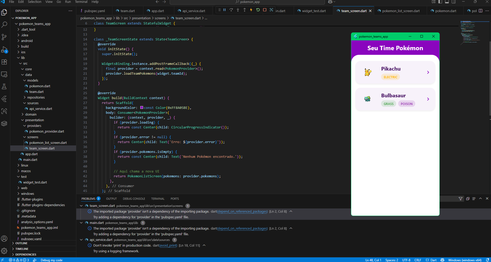
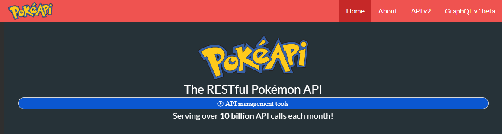

# Pokémon Teams App (Frontend)

## Minha Jornada com esse Projeto

Este projeto nasceu de uma faísca de inspiração durante um desafio técnico para uma vaga de desenvolvedor backend. Eu queria muito ver aquele backend rodando de verdade, sentir o projeto ganhar vida. Então, empolgado e cheio de vontade de aprender, decidi criar um frontend em Flutter para acompanhar a API que construí.

Foi um momento de pura motivação: em poucas horas, montei uma tela inicial simples, mas funcional, que mostra a lista de Pokémons do time, puxando os dados direto da API. Ver cada Pokémon aparecer na tela, com suas cores e tipos, e poder abrir um card animado para ver detalhes — isso me deu um sentimento único de realização.

Além da empolgação, quis construir o app com boas práticas, usando Provider para o gerenciamento de estado, um design modular e pensando na escalabilidade futura. É um projeto que reflete não só minha vontade de codar, mas também de entregar algo limpo, organizado e fácil de evoluir.

Hoje, o app mostra uma tela inicial com a lista dos Pokémons, com nome, imagem e seus tipos destacados, e um card detalhado que pode ser virado para revelar informações extras como altura, peso, estatísticas e evoluções.

Ainda há muito o que fazer, e pretendo continuar aprimorando esse frontend, mas o que importa é que esse projeto representa meu jeito de aprender, minha paixão por desenvolver e a minha determinação em transformar ideias em código funcional.

---

## 🖼️ Capturas de Tela

### Tela Inicial do App


### Visualização dos Dados da API


## Funcionalidades

- Listagem dos Pokémons do time via API REST.
- Visualização de detalhes do Pokémon em card animado com efeito de virar.
- Destaque visual dos tipos com cores específicas para melhor experiência.
- Arquitetura limpa com Provider para gerenciamento de estado.
- Modularidade e organização para fácil manutenção e evolução.

---

## Como Rodar o Projeto

### Pré-requisitos

- Flutter instalado (versão estável recomendada)
- Backend da API rodando localmente em `http://localhost:3000` (ou ajuste o baseUrl conforme necessário)

### Passos

1. Clone este repositório:
   ```bash
   git clone https://github.com/LucasLikes/pokemon-teams-frontend.git
   cd pokemon-teams-frontend/pokemon_teams_app
   ```

2. Instale as dependências:
   ```bash
   flutter pub get
   ```

3. Ajuste a URL base da API no arquivo `lib/main.dart` caso sua API esteja em outro endereço.

4. Execute o app:
   ```bash
   flutter run
   ```

---

## Estrutura do Projeto

- `lib/main.dart`: Ponto de entrada, configura Provider e inicia a aplicação.
- `lib/src/app.dart`: Configuração geral do MaterialApp e navegação.
- `lib/src/data/models/pokemon.dart`: Modelo de dados com JSON serialização.
- `lib/src/data/sources/api_service.dart`: Comunicação com API REST.
- `lib/src/data/repositories/pokemon_repository.dart`: Repositório que acessa dados via API.
- `lib/src/presentation/providers/pokemon_provider.dart`: Gerenciamento de estado via Provider.
- `lib/src/presentation/screens/pokemon_list_screen.dart`: Tela principal da lista de Pokémons.
- `lib/src/presentation/screens/widgets/pokemon_detail_card.dart`: Card animado para detalhes do Pokémon.

---

## Próximos Passos e Melhorias

- Completar informações no verso do card com habilidades e mais detalhes.
- Melhorar UX com estados de carregamento e tratamento de erros.
- Implementar cache local para otimizar performance.
- Expandir a navegação e funcionalidades para criação e edição de times.
- Testes unitários e integração para maior qualidade.

---

## Contato

Lucas Likes  
[GitHub](https://github.com/LucasLikes)  
Email: seuemail@exemplo.com

---

*Este projeto é minha forma de transformar desafios técnicos em aprendizado prático e diversão com código.*
